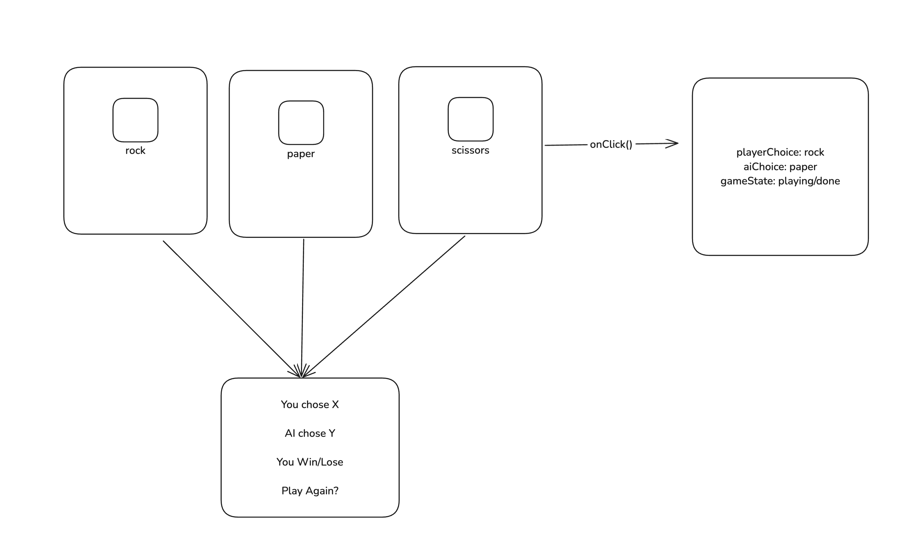
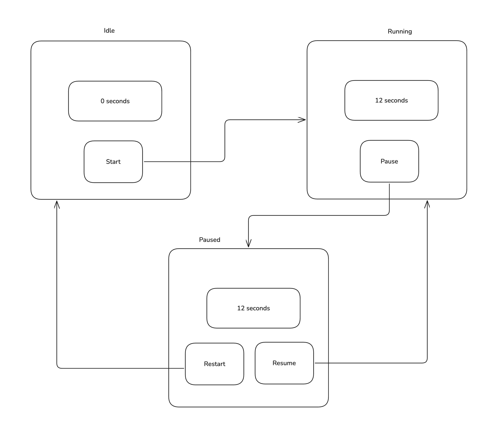
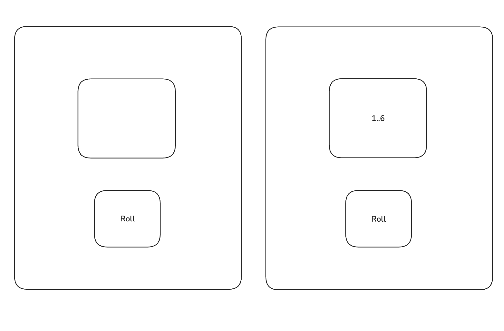

# learn-react

- Build 20 things to learn how to use react
- Diagram to understand state 
- [source](https://webdevcody.gumroad.com/l/beginner-react-challenges-collection)

## rock paper scissors

## stopwatch

## dice

